# M06-UF-04
M06_UF-04-Databases

1. Captura metodo read product by id

Este metodo te devuelve el producto almacenado en la bd en este caso con id 1. Es un metodo para buscar un producto en concreto

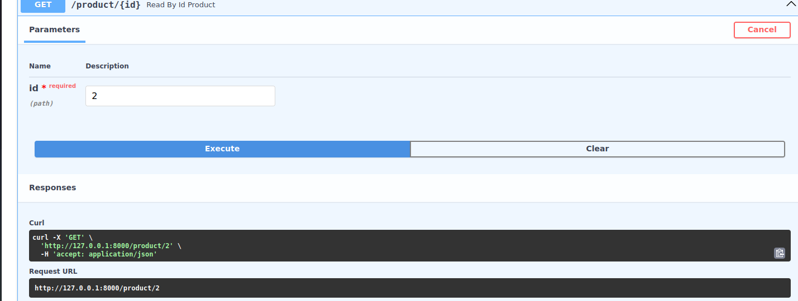

Si esque lo encuentra, devolvera codigo 200

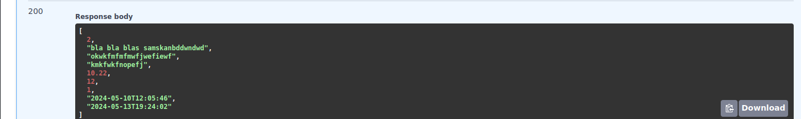

2. Captura metodo update producto

Nuestro metodo de update producto cambia todos los campos de este. A través de /product/{id} donde id es el codigo identificador del producto que queremos cambiar, nos permitira introducir los nuevos valores. 

Esto es nuestro producto con id 2 antes del cambio
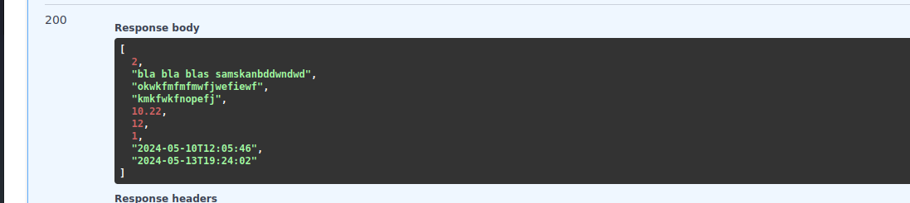

Lo cambiamos
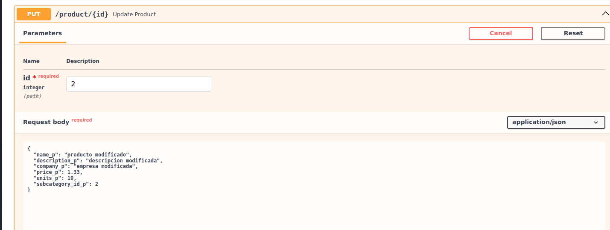

Si el update ha sido correcto, devolverá codigo 200 
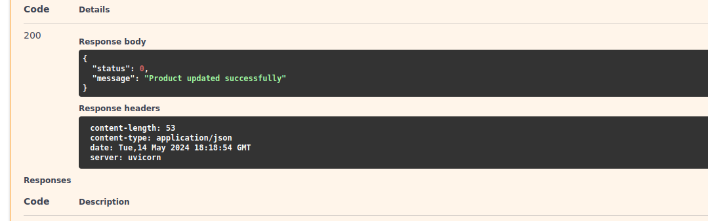
Resultado:
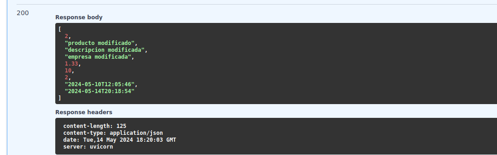

3. Metodo delete product

Basicamente le pasas el id del producto que quieras borrar de la base de datos, y si existe lo borra
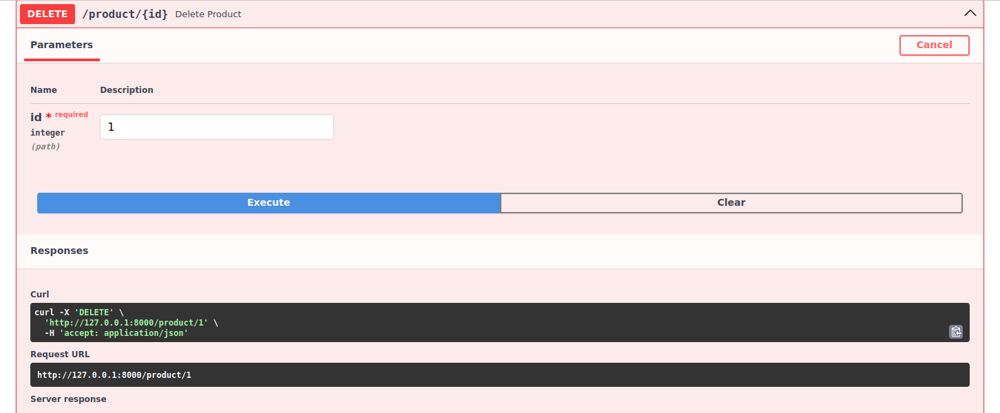

si todo va bien, devuelve codigo 200 de que ya esta eliminado 
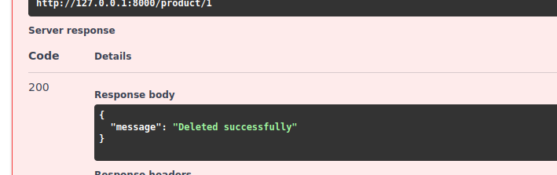

4. Metodo create product

Este metodo es para insertar un nuevo producto a la base de datos, salen los campos para editar directamente 
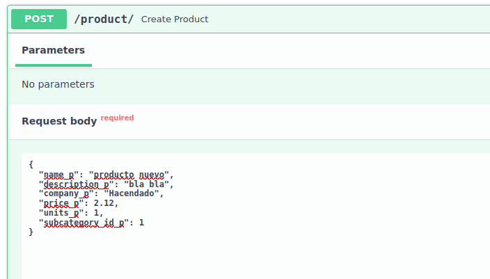

La api responderá con mensaje de exito 
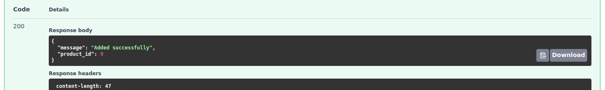

5. Captura Metodo readProducts

Te devuelve todos los productos en la base de datos

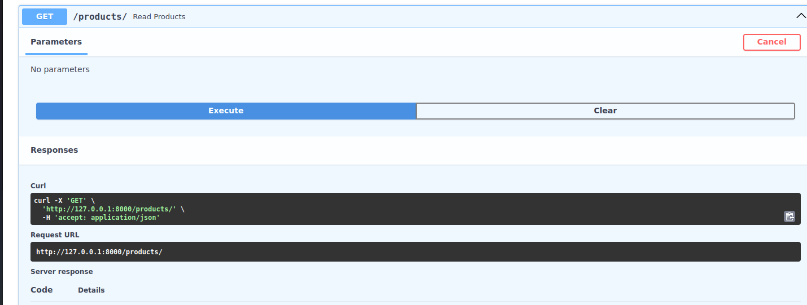

Y obtenemos la lista en forma json:

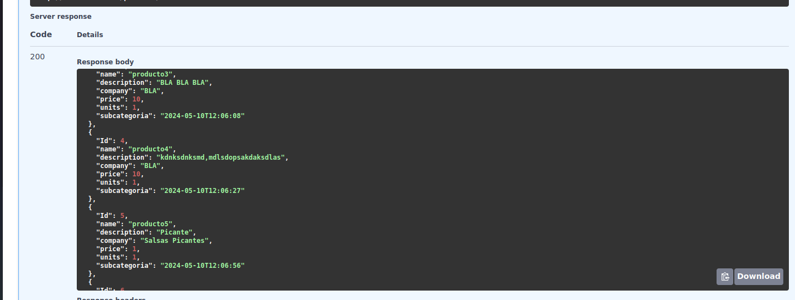

